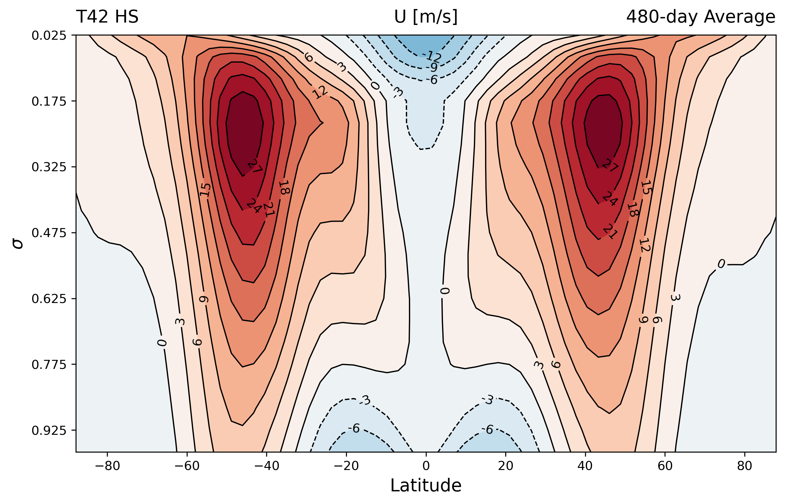

# idealized-spectral-gcm

**A light-weighted global circulation model (GCM) written in Julia.**

This package implements a spectral dynamical core solving the primitive equations on the sphere. It is designed for idealized atmospheric research, educational purposes, and algorithmic prototyping. It serves as a modern refactor of the legacy spectral core originally developed by Daniel Zhengyu Huang.



## Numerical Methods

### 1. Horizontal Discretization
The model uses the **Spectral Transform Method**. Variables such as vorticity $\zeta$ and divergence $D$ are expanded in spherical harmonics $Y_n^m(\lambda, \phi)$:

$$\zeta(\lambda, \phi, t) = \sum_{m=-M}^{M} \sum_{n=|m|}^{N(m)} \zeta_n^m(t) Y_n^m(\lambda, \phi)$$

Non-linear terms (like advection) are computed on a **Gaussian Grid** to avoid the cost of convolution sums, using the efficient transform provided by `Spectral_Spherical_Mesh.jl`.

### 2. Vertical Discretization
The vertical column is discretized using **Finite Differences** on hybrid $\sigma-p$ coordinates.

### 3. Time Integration
Time stepping is handled via a **Semi-Implicit Leapfrog** scheme.
* **Gravity waves:** Treated implicitly to allow for longer time steps ($\Delta t$).
* **Advection/Coriolis:** Treated explicitly.
* **Time Filter:** A Robert-Asselin filter is applied to suppress the computational mode inherent to the leapfrog scheme.

## Installation

```shell
git clone https://github.com/Brownian-Motion-99/idealized-spectral-gcm.git
```

## Quick Start

### Held-Suarez Test Case

To run a standard dry dynamic benchmark:

```julia
julia --project=. exp/HSt21/HS.jl
```

### Moist Held-Suarez Case

To run a Held-Suarez Case with grid scale condensation and planetary boundary layer parameterization:

```julia
julia --project=. exp/HSt42/HS.jl
```